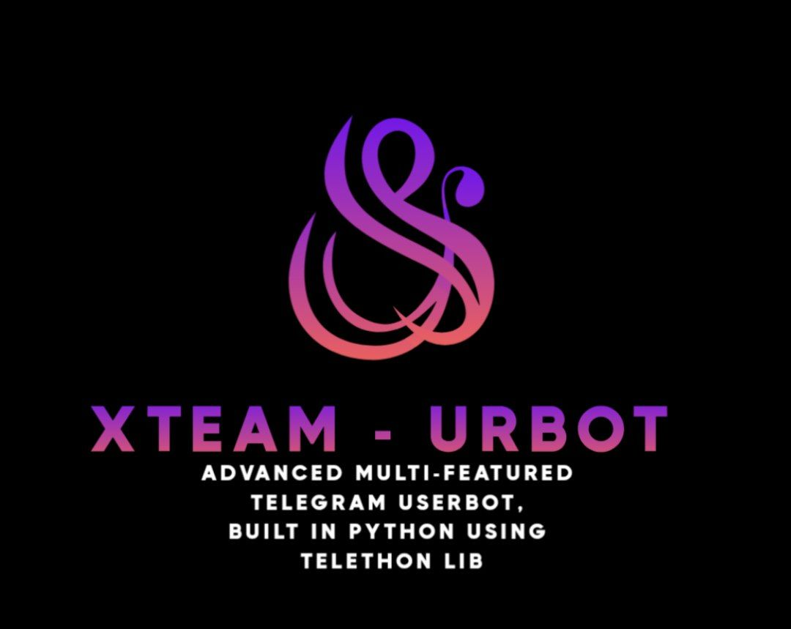

<p align="center"></p>
<p align="center"> 
</p>
<h2 align="center">𖤓 xᴛᴇᴀᴍ ᴜʀʙᴏᴛ 𖤓</h2></h2>
<p align="center"></p>

[](https://github.com/xteam-cloner/xteam-userbot/stargazers)
[](https://github.com/xteam-cloner/xteam-userbot/fork)
[](https://github.com/xteam-cloner/xteam-userbot/)   
[](https://www.python.org/)
[](https://github.com/xteam-cloner/xteam-userbot/graphs/commit-activity)
[](https://github.com/xteam-cloner/xteam-userbot)
[](https://github.com/xteam-cloner/xteam-userbot/blob/main/LICENSE)   
----
</b>

<h3 align="center">
    ─「 ᴅᴇᴩʟᴏʏ ᴏɴ ᴠᴘs 」─
</h3>

<details>
<summary><b>𝐕𝐏𝐒</b></summary>
<br>
  
Copy these blue words on by on from here to use commands in you own vps.
</h3>

✨ Clone the repository:
```console
git clone https://github.com/xteam-cloner/xteam-userbot
```

✨ Go to the cloned folder:
```console
cd xteam-userbot
```
✨ Create a virtual env:
```console
virtualenv -p /usr/bin/python3 venv 
 . ./venv/bin/activate
```
✨ Install the requirements:
```console
pip3 install --no-cache-dir  -r requirements.txt
```

✨ Fill your 
[Variabel](https://github.com/xteam-cloner/xteam-userbot/blob/fc51891b04f305be6a7ea025e1164007d1866ee2/.env.sample) in the env by

```console
nano .env
```

✨ If you have finished edit, CTRL S + CTRL X.

✨ Install screen to keep running your bot when you close the terminal by
```console
screen -S xteam-userbot
```
✨ Finally Run the bot:
```console
bash start
```
✨ For getting out from screen session press
• Ctrl+a and Ctrl+d

<a href="https://heroku.com/deploy?template=https://github.com/xteam-cloner/xteam-userbot">
  
</a>

✨ Termux Session Gen
```console
apt update && apt upgrade -y && apt install python wget -y && pip install Telethon && wget https://raw.githubusercontent.com/xteam-cloner/xteam-userbot/dev/resources/session/ssgen.py && python ssgen.py
```
</details>

# License
[](LICENSE)   
xteam is licensed under [GNU Affero General Public License](https://www.gnu.org/licenses/agpl-3.0.en.html) v3 or later.

# Credits
* [](https://t.me/UltroidDevs)
* [](https://t.me/xteam_cloner)
* [](https://github.com/pytgcalls/pytgcalls)
* [](https://github.com/LonamiWebs/Telethon)
</h3>
<p align="center"></p>
<p align="center"></p>
